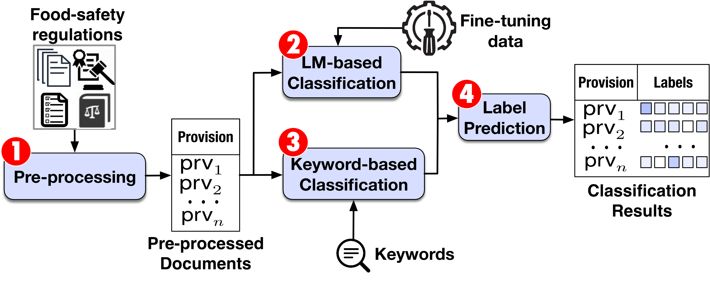

# FSR
Automated Classification of Requirements-related Provisions in Food-safety Regulations

## Description

In this paper, we propose to develop 1) a conceptual characterization of food-safety concepts that closely relate to systems and software requirements and 2) a BERT-based approach to automatically classify legal provisions according to requirements-related food-safety concepts. We empirically evaluate our classification approach with BERT variants, e.g., BERT large, RoBERTa, ALBERT and non-transformer models including: BiLSTM and Keyword Search.
An overview of the approaches are discussed below:

* Pre-processing
* LM-based Classification
* Keyword-based Classification
* Label Prediction

## Content description
* Code: contains scripts related to the implementation of all the approaches in this paper. It contains three subfolder namely RQ1, RQ2, and Supplementary Code.
    * RQ1: contains code related to the BERT-based Language Models implemented for answering RQ1 and the prerequisite pakages in the requirement.txt.
    * RQ2: contains code for BiLSTM and Keyword Search baseline models and the prerequisite pakages in the requirement.txt.
    * Supplementary: contains subsidiary codes, including: Food Safety Sentence Statistics (retrieves the content of food safety-related URLs and calculates various statistics on the number of sentences found in them, such as the mean, standard deviation, and other relevant metrics), scripts for Classification Evaluation and Significance Testing (takes classification reports as input and generates a dataframe with precision, recall, and f-score values for each label. It then performs statistical significance testing between two models using the generated dataframe) and Boxplot Visualization (uses the second dataframe generated in the previous notebook to create boxplots, showcasing the distribution of results.

* Evaluation Results: contains two subfolder namely RQ1 and RQ2. 
    * RQ1: includes Precision, Recall and F-Score for the BERT variants classification results, along with the model hyperparameters and statistical significance tests of comparing BERT base approach against these BERT variants.
    
    * RQ2: includes BiLSTM hyperparameters and statistical significance tests of comparing our approach against baselines.
    
* Data: contains datasets including qualitative data derived from qualitative coding and evaluation data annotated by third-part annotators.

### Instructions to run the proposed algorithms

* Create a python environment with the packages listed in: FSR/Code/RQ1/Requirement.txt
* Open the environment and proceed to FSR main folder, FSR/Code/RQ1/BERTbase.py

## Version History

Initial Release

## Acknowledgments
